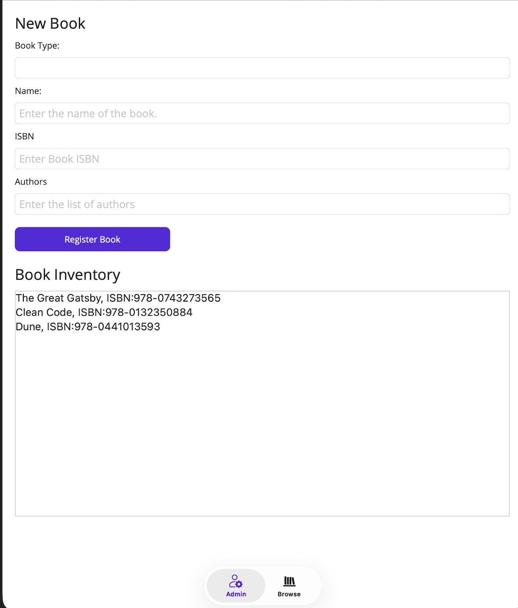
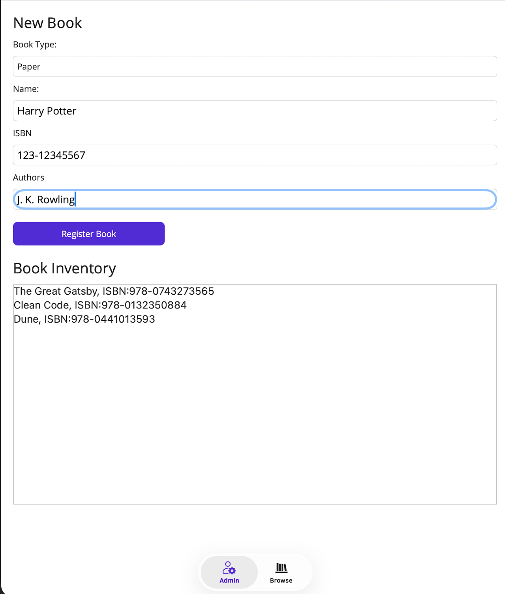
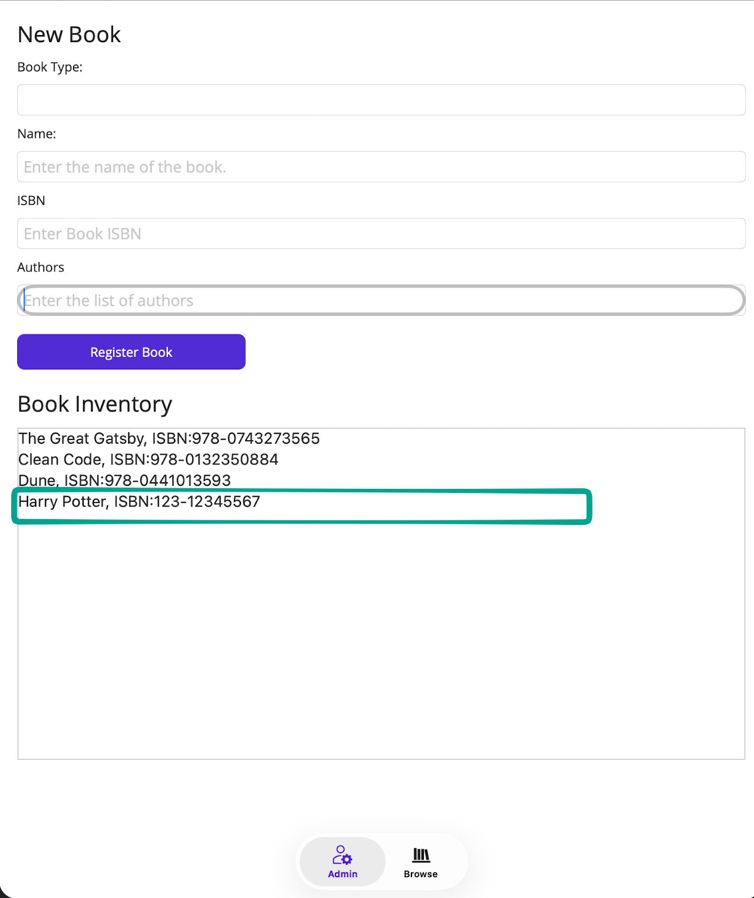
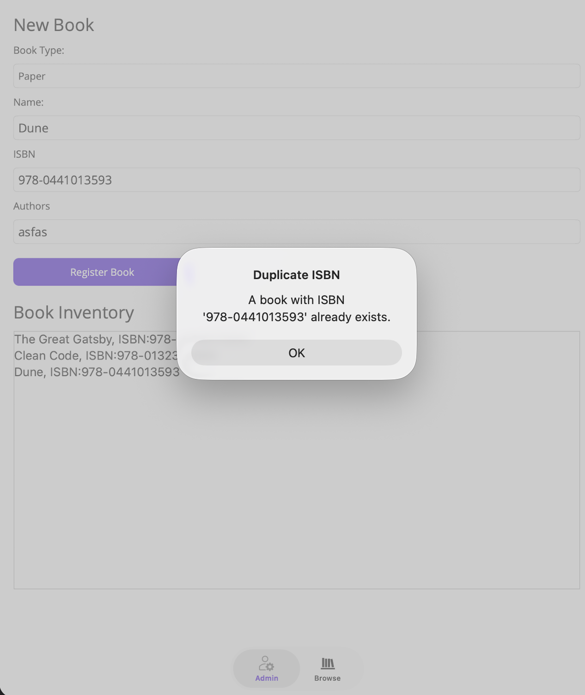
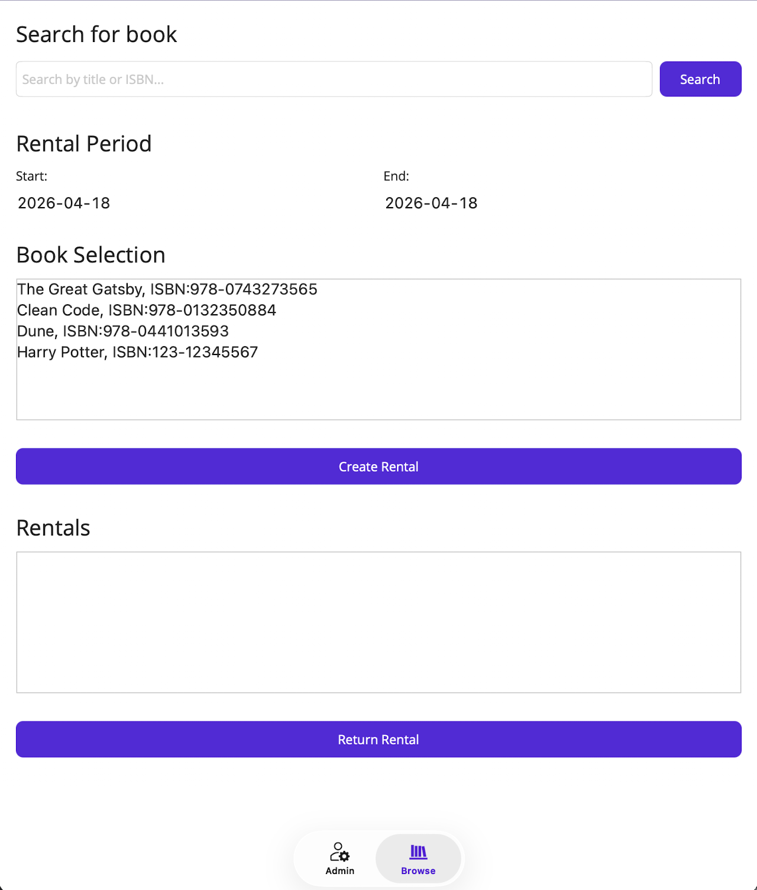
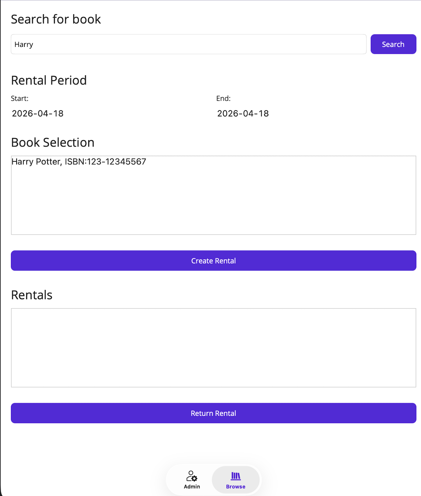
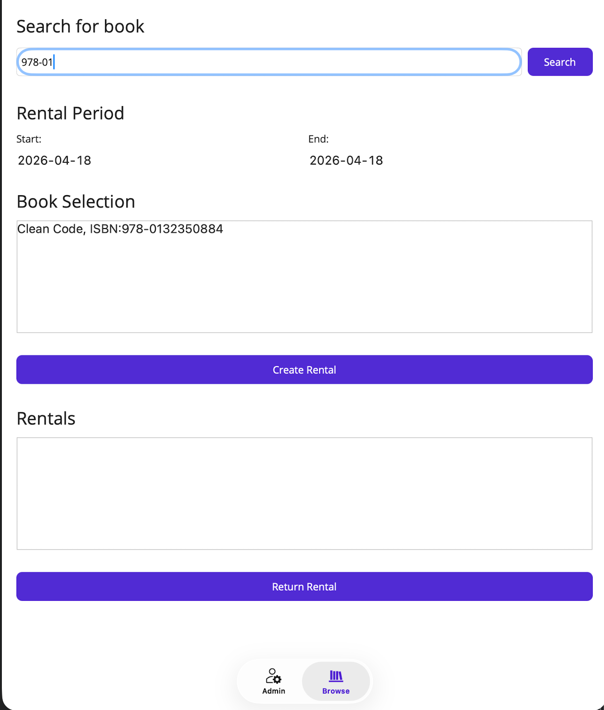
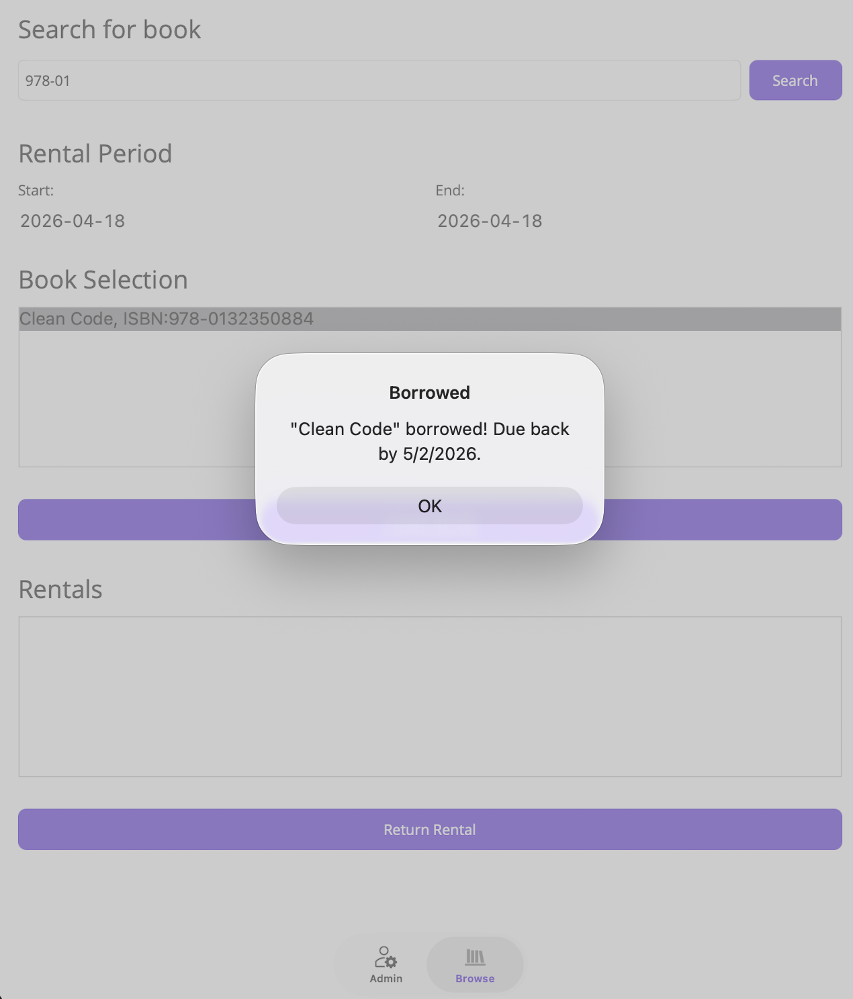
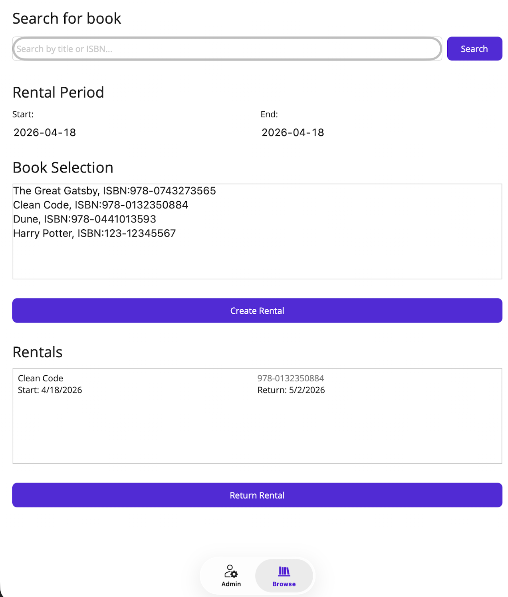
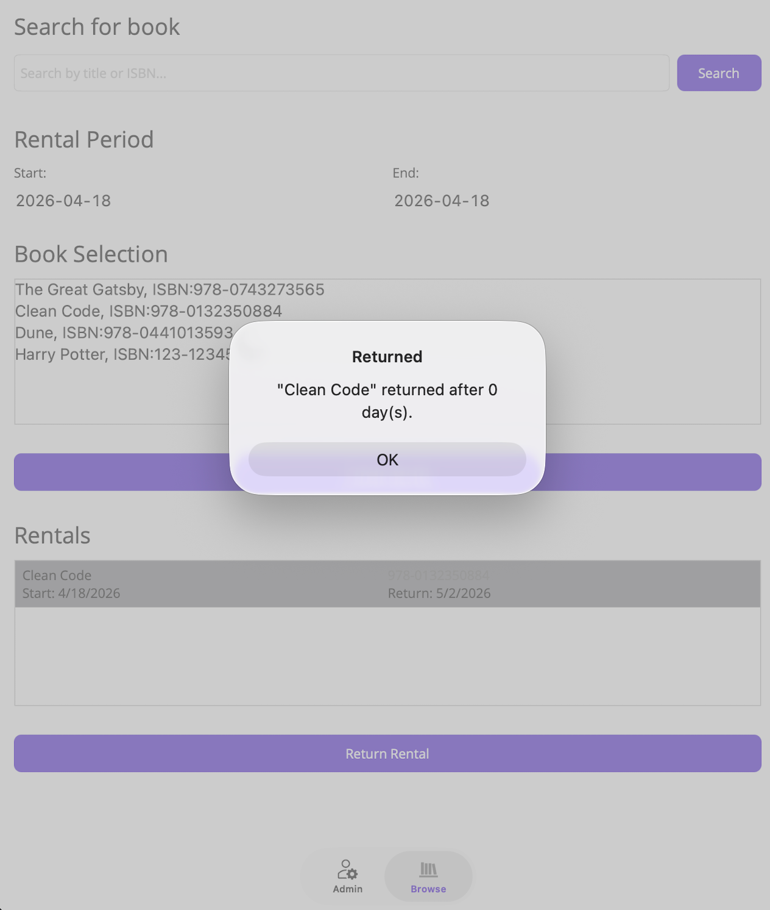

# LibraryApp Interactive - Application Report

## App Navigation

The app uses a **Shell TabBar** - two tabs always visible at the bottom:

---

## Page Walkthrough

### Tab 1 - Admin Page

**Purpose:** Register new books into the library catalog.

---

**Screenshot 1 - Fresh Load**

On first launch, the Admin tab shows a blank "New Book" form (Book Type picker, Name, ISBN, Authors fields + Register Book button) and a "Book Inventory" list pre-populated with 3 default books: *The Great Gatsby*, *Clean Code*, and *Dune*.

---

**Screenshot 2 - Filling in a New Book**

The user fills in Book Type: Paper, Name: Harry Potter, ISBN: 123-12345567, Authors: J. K. Rowling. The inventory is still showing the original 3 books while the form is being completed.

---

**Screenshot 3 - Book Added to Inventory**

After pressing Register Book, the form clears and *Harry Potter, ISBN:123-12345567* appears at the bottom of the inventory list, highlighted with a teal border. 1 copy is created.

---

**Screenshot 4 - Duplicate ISBN Error**

Attempting to register a book with an existing ISBN (e.g. Dune's `978-0441013593`) triggers a "Duplicate ISBN" alert dialog. The `FindBookByISBN()` guard prevents the duplicate from being added.

---

### Tab 2 - Browse Page

**Purpose:** Search the catalog, borrow books, track active rentals, and return them.

---

**Screenshot 5 - Browse Page (Fresh)**

The Browse tab has four sections: Search bar, Rental Period date pickers (Start/End, defaulting to today), Book Selection list (all 4 books including Harry Potter - shared singleton in action), and an empty Rentals list. Two action buttons: Create Rental and Return Rental.

---

**Screenshot 6 - Search by Title**

Typing "Harry" and pressing Search filters the Book Selection list to only `Harry Potter, ISBN:123-12345567`. Search uses `String.Contains` with `OrdinalIgnoreCase`.

---

**Screenshot 7 - Search by ISBN**

Typing "978-01" (partial ISBN) filters to `Clean Code, ISBN:978-0132350884`. Both title and ISBN fields are searched simultaneously.

---

**Screenshot 8 - Creating a Rental**

With Clean Code selected, pressing Create Rental shows a "Borrowed" dialog: *"Clean Code" borrowed! Due back by 5/2/2026.* `BorrowBook()` sets the asset status to `Loaned` and records `BorrowedOn = now`, `DueDate = now + 14 days`.

---

**Screenshot 9 - Rentals List**

After dismissing the dialog, the Rentals section shows the active loan with book name, ISBN, start date (4/18/2026), and return-by date (5/2/2026). `RefreshLoansList()` scans all assets for `Status == Loaned`.

---

**Screenshot 10 - Returning a Book**

With the Clean Code rental selected, pressing Return Rental shows: *"Clean Code" returned after 0 day(s).* `ReturnBook(libID)` resets status to `Available` and calculates any late fine ($0.25/day overdue) - $0 here since returned same day.

---

## Business Logic Summary

| Operation | Method | Key Behavior |
|---|---|---|
| Register book | `Library.RegisterBook()` | Creates Book + N LibraryAsset copies with auto-IDs |
| Borrow | `Book.BorrowBook()` | Finds first Available asset, sets Loaned + 14-day DueDate |
| Return | `Book.ReturnBook(libID)` | Duration + $0.25/day late fine if overdue |
| Search | `OnSearchClicked()` | LINQ Where on Name + ISBN, OrdinalIgnoreCase |
| Duplicate guard | `Library.FindBookByISBN()` | Alert dialog blocks re-registration |

